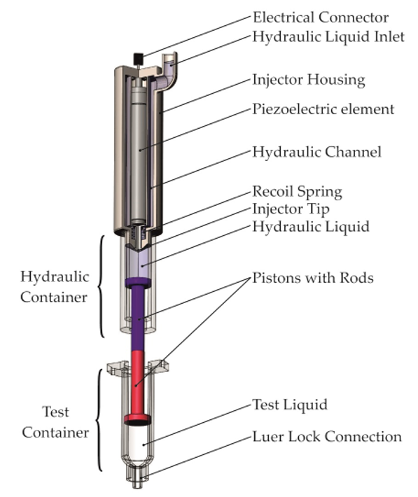
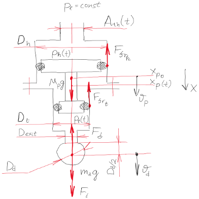
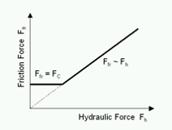
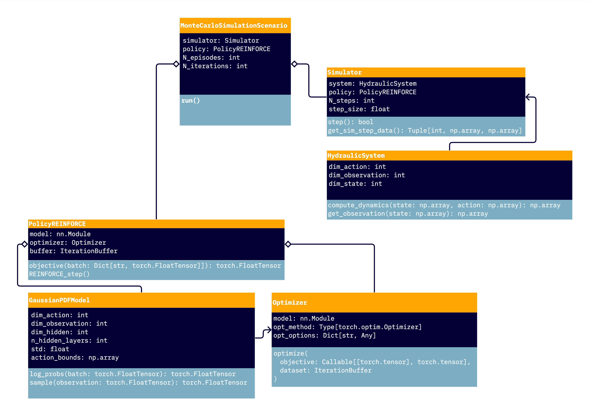
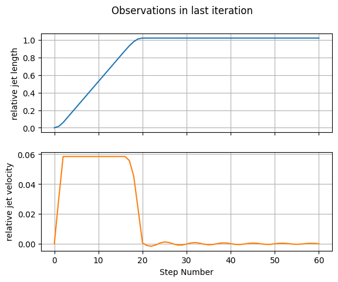
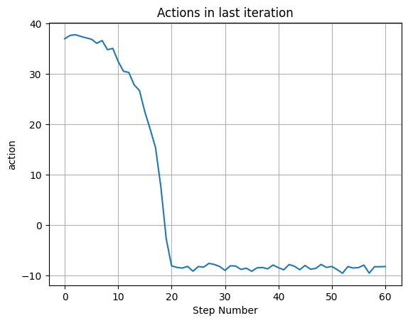

# Droplet Generator optimal control
The **goal** of this project is to create an optimal control of the droplet generator (it's hydraulic part) by Reinforcement Learning.

## Content
- Current main notebook with a detailed description of the Droplet Generation System is introduced in the root of the repository ([reinforce_hydraulic_system.ipynb](https://github.com/mvulf/drop_control/blob/main/reinforce_hydraulic_system.ipynb))
- Conducted research is introduced in the [research](https://github.com/mvulf/drop_control/tree/main/research) folder:
    - Searching of the **best running cost** function is introduced in the notebooks [reinforce_jet_length_penalty.ipynb](https://github.com/mvulf/drop_control/blob/main/research/reinforce_jet_length_penalty.ipynb), [reinforce_pos_vel_penalty.ipynb](https://github.com/mvulf/drop_control/blob/main/research/reinforce_pos_vel_penalty.ipynb), and [reinforce_vel_reward_and_penalty.ipynb](https://github.com/mvulf/drop_control/blob/main/research/reinforce_vel_reward_and_penalty.ipynb). 
    - Next two notebooks ([reinforce_vel_reward_and_penalty_continue.ipynb](https://github.com/mvulf/drop_control/blob/main/research/reinforce_vel_reward_and_penalty_continue.ipynb) and [reinforce_vel_reward_and_penalty_continue_2.ipynb](https://github.com/mvulf/drop_control/blob/main/research/reinforce_vel_reward_and_penalty_continue_2.ipynb)) were used to continue weights updating and to save obtained model as [model_policy_reinforce_updated_2.pkl](https://github.com/mvulf/drop_control/blob/main/models/model_policy_reinforce_updated_2.pkl). It was necessary to separate solution, since some freezing happends due to the solve_ivp: it takes a lot of time to calculate states when throttle position near the 0.
    - Other two notebooks ([reinforce_hydraulic_system_higher_lr_less_std.ipynb](https://github.com/mvulf/drop_control/blob/main/research/reinforce_hydraulic_system_higher_lr_less_std.ipynb) and [reinforce_hydraulic_system_higher_lr_less_std_continue.ipynb](https://github.com/mvulf/drop_control/blob/main/research/reinforce_hydraulic_system_higher_lr_less_std_continue.ipynb)) were used to tune hyperparams. Achieved results are introduced as .pdf files in research folder [RHS-HLr-LStd-C_last_*.pdf](https://github.com/mvulf/drop_control/tree/main/research)
    - Finally, fitting of the PD-regulator via RL-approach is introduced in [reinforce_fit_PD_regulator.ipynb](https://github.com/mvulf/drop_control/blob/main/research/reinforce_fit_PD_regulator.ipynb) and other notebooks with the same name.
- Obtained models binaries are introduces in [models](https://github.com/mvulf/drop_control/tree/main/models) folder. Description of models is introduced in research-section as well as in the related notebooks.
- Folder [tests](https://github.com/mvulf/drop_control/tree/main/tests) consists of the system and simulator tests.

## Brief Description
See detailed description [here](https://github.com/mvulf/drop_control/blob/main/reinforce_hydraulic_system.ipynb): state dynamics function, observations, running cost function, NN policy model, Policy, Monte Carlo Simulation Scenario, Main loop

### Problem setup

Piston moves by the hydraulic and friction forces action:

$$
    m_p\ddot{x_p} = m_pg + F_h - F_{fr},
$$

#### Hydraulic force:

$$
    F_h = p_h A_h - p_t A_t,
$$

where hydraulic container pressure, according to the Darcy-Weisbach equation and relationship of the lateral surface area of the throttle "cylinder" to the position of the spool (**action**) $A_{th}(t) = \pi D_{th} x_{th}(t)$:

$$
    p_h = p_l - \frac{\zeta_{th}\rho_h D_h^4}{32D_{th}^2}\left(\frac{\dot{x_p}}{x_{th}}\right)^2
$$

test container pressure (according to the Darcy-Weisbach equation):

$$
    p_t = p_{atm} + \frac{\zeta_{exit}\rho_t D_t^4}{2D_{exit}^4}\dot{x_p}^2
$$

Hydraulic/Test container area:

$$
    A_{h,t}=\frac{\pi D_{h,t}^2}{4}
$$

$p_l$ - pressure of the hydraulic liquid before throttling;
$p_{atm}$ - ambient environment (atmosphere) pressure;
$\zeta_{th}, \zeta_{exit}$ - hydraulic loss coefficients at throttle and at syringe exit respectively;
$\rho_h, \rho_t$ - densities of the hydraulic and test containers liquids

#### Friction
Friction $F_{fr}$ can be considered both by a stribeck curve or mechanical efficiency.
Let us use a mechanical efficiency approach:

$$
    F_{fr} = \max{(F_C, (1-\eta)F_h)},
$$

where $\eta$ - mechanical efficiency;
Coulomb friction force:

$$
    F_C = p_C\cdot\max{(A_h, A_t)}
$$

$p_C$ - pressure difference, which is necessary to overcome the dry friction

### Solution Implementation

The code is organized as follows. The **main loop** (see below) is implemented in `MonteCarloSimulationScenario` which starts REINFORCE learning procedure via `run` method. During the main loop all observations, actions, running costs for every episode and step are collected in `IterationBuffer` object which is constructed in `PolicyREINFORCE`. After every iteration `MonteCarloSimulationScenario` calls `REINFORCE_step` method  which does gradient descent step via calling the `optimize` method that is implemented in `Optimizer`.

## Results

After **475** iterations conducted simultaneously in notebooks ([reinforce_hydraulic_system_higher_lr_less_std.ipynb](https://github.com/mvulf/drop_control/blob/main/research/reinforce_hydraulic_system_higher_lr_less_std.ipynb) and [reinforce_hydraulic_system_higher_lr_less_std_continue.ipynb](https://github.com/mvulf/drop_control/blob/main/research/reinforce_hydraulic_system_higher_lr_less_std_continue.ipynb)), last observations and actions were obtained:

## Literature
The consideration of jet length as an objective for control of the droplet formation was inspired by [[1](https://doi.org/10.1007/s00348-003-0629-6), [2](https://doi.org/10.1201/9781420040470)]